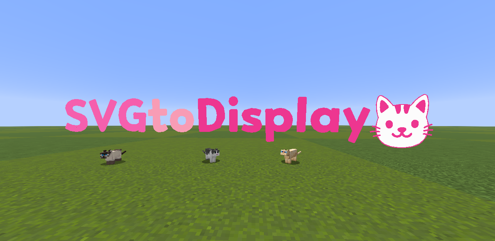

# 😺 SVGtoDisplay

### Convert svg to minecraft display entities.

### link: https://minkyet.github.io/SVGtoDisplay

### Features

- Polygonize the curve to the desired precision.
- Set the block type or color you want.
- Apply the colors of the original SVG to the text display.
  > [!WARNING]
  > Gradient colors are not applied.